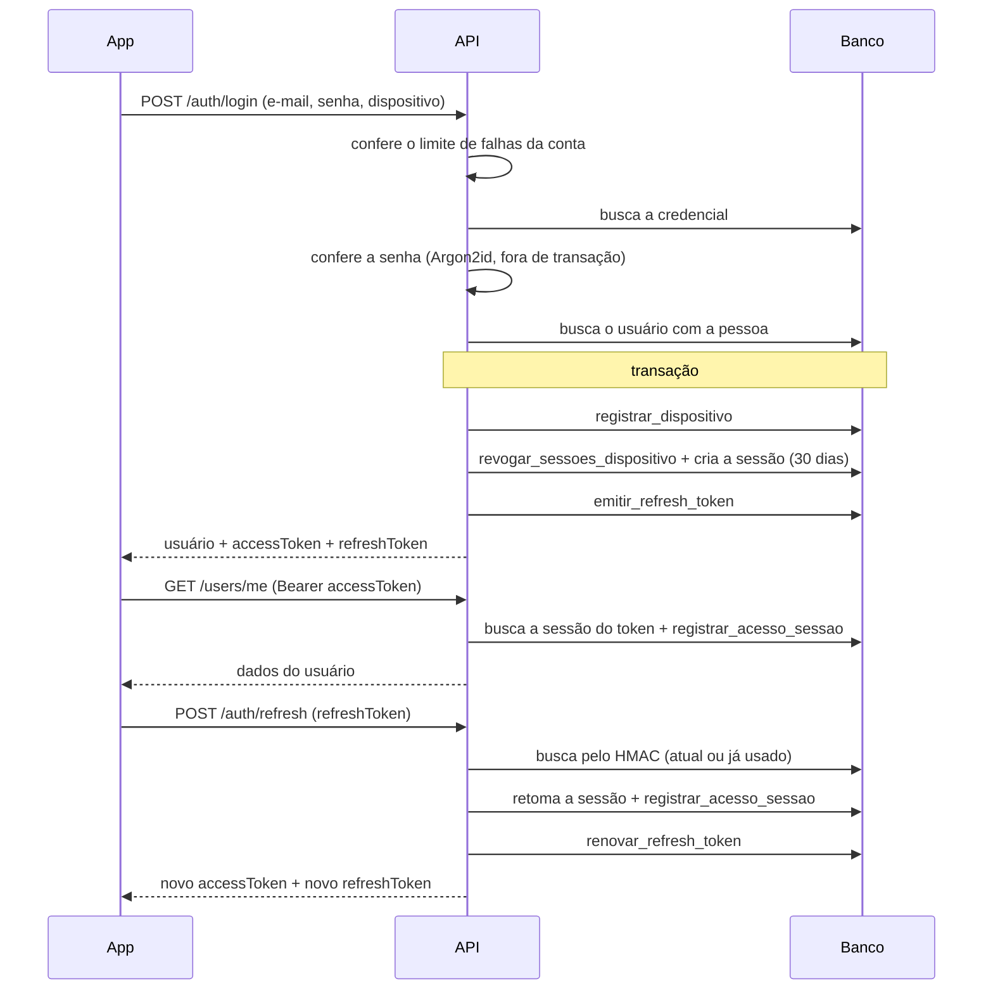

# vsr

API REST para gestão de **vistorias de imóveis**: cadastro de pessoas e empresas, imóveis e seus proprietários, e o registro de vistorias de entrada e saída, organizadas em ambientes, itens e evidências fotográficas.

O módulo de **identidade e acesso** (cadastro, login, sessões por dispositivo, tokens e troca de senha) está implementado na API. O restante do domínio já está modelado no banco de dados e será exposto pela API nas próximas etapas.

---

## Sumário

- [Tecnologias](#tecnologias)
- [Banco de dados](#banco-de-dados)
- [Regras de negócio](#regras-de-negócio)
  - [Cadastro](#cadastro)
  - [Login, dispositivos e sessões](#login-dispositivos-e-sessões)
  - [Tokens](#tokens)
  - [Logout e troca de senha](#logout-e-troca-de-senha)
  - [Validação de dados](#validação-de-dados)
  - [Limite de requisições](#limite-de-requisições)
  - [Envio de e-mail](#envio-de-e-mail)
  - [Domínio de vistorias](#domínio-de-vistorias)
- [API](#api)
- [Segurança](#segurança)
- [Configuração e execução](#configuração-e-execução)
- [Testes](#testes)

---

## Tecnologias

| Camada | Tecnologia | Versão |
|---|---|---|
| Linguagem | Java | 17 |
| Framework | Spring Boot (Web MVC, Security, Data JPA, Validation, Mail) | 4.1.1 |
| Banco de dados | PostgreSQL com a extensão `pg_cron` | 17 |
| Migrations | Flyway | gerenciado pelo Spring Boot |
| ORM | Hibernate | 7 (via Spring Boot) |
| Access token | JWT HS256 com `com.auth0:java-jwt` | 4.6.1 |
| Hash de senha | Argon2id com BouncyCastle (`bcprov-jdk18on`) | 1.84 |
| Mapeamento | MapStruct e Lombok | 1.6.3 |
| Testes | JUnit, Mockito, MockMvc, Spring Security Test, PostgreSQL embutido (`io.zonky.test:embedded-postgres`) | zonky 2.1.0 |
| Build | Maven (wrapper incluso) | |

### Spring Boot e Spring Web MVC

Servidor HTTP e camada REST. O **versionamento da API** usa o suporte nativo do Spring: todas as rotas ficam sob `/api/{versao}`, e a versão também pode ser negociada por um cabeçalho configurável. As respostas de erro seguem a **RFC 9457** (`ProblemDetail`).

### Spring Security

Configurado como **stateless**: não há sessão HTTP nem cookie, e o CSRF fica desligado, porque a API só aceita tokens no cabeçalho `Authorization`. A autenticação de e-mail e senha usa o `DaoAuthenticationProvider` do Spring, que já protege contra a descoberta de contas pelo tempo de resposta: quando o e-mail não existe, ele calcula um hash falso para gastar o mesmo tempo.

A cadeia tem quatro filtros próprios, nesta ordem:

1. **Tratamento de exceções:** converte erros lançados nos filtros em `ProblemDetail`.
2. **Limite de requisições:** aplica o limite da rota pela rede do cliente.
3. **Tamanho do corpo:** recusa corpos grandes antes de qualquer leitura.
4. **Autenticação:** valida o JWT e confirma que a sessão do token está ativa e pertence ao usuário.

### PostgreSQL e pg_cron

O banco concentra as regras que precisam de garantia mesmo sob concorrência:
- **Constraints** de validação (CPF, CNPJ, e-mail, tamanhos), com funções reutilizáveis.
- **Procedures** para as escritas que vão além do CRUD (sessões, refresh tokens, troca de senha).
- **Regras com o prefixo `rn_`:** quando uma procedure detecta uma violação (por exemplo, uma sessão inativa), ela lança um erro com o nome da regra. A API converte esse nome no status HTTP correspondente.
- **`pg_cron`** agenda as rotinas de manutenção dentro do próprio banco, sem depender de um agendador na aplicação.

### Flyway e Hibernate

O **Flyway** é o dono do schema: aplica as migrations na subida da aplicação. O Hibernate roda com `ddl-auto: validate`, então só confere se as entidades batem com o banco e nunca altera tabelas.

O `open-in-view` está **desligado**: a conexão com o banco fica presa só durante as transações, e não durante toda a requisição. Isso é importante porque o hash de senha (Argon2) é lento e roda fora de transação, então nenhuma requisição de login segura uma conexão do pool enquanto calcula o hash.

### JWT (java-jwt)

O access token é um JWT assinado com **HMAC-SHA-256**. A chave precisa ter no mínimo 32 bytes, senão a aplicação não inicia. A verificação confere a assinatura, o emissor (`iss`), a presença da sessão (`sid`) e a expiração, com tolerância de 30 segundos para diferenças de relógio. O JWT sozinho não basta: a cada requisição a sessão referenciada também é conferida no banco, por isso revogar uma sessão invalida o token na hora.

### Refresh token opaco com HMAC

O refresh token **não é um JWT**: são 32 bytes aleatórios (`SecureRandom`) codificados em Base64 URL. O banco guarda só o **HMAC-SHA-256** do token, calculado com uma chave que fica fora do banco. Assim, um vazamento do banco não permite usar nem reconstruir os tokens.

### Argon2id (BouncyCastle)

As senhas são guardadas com **Argon2id**, o algoritmo recomendado pela OWASP, com 19 MiB de memória, 2 iterações, paralelismo 1, salt de 16 bytes e hash de 32 bytes. O BouncyCastle fornece a implementação usada pelo `Argon2PasswordEncoder` do Spring Security.

### MapStruct e Lombok

O **MapStruct** gera em tempo de compilação a conversão entre entidades e respostas da API, sem reflexão em tempo de execução. O **Lombok** elimina o código repetitivo (construtores, getters e builders) das entidades e dos componentes.

### Jakarta Mail

Envio de e-mail por SMTP com **STARTTLS obrigatório**, em texto simples ou com anexos. Ainda não é usado por nenhum fluxo; está pronto para a confirmação de e-mail e a recuperação de senha.

### Tempo

Toda data e hora gerada pela aplicação (expiração de sessão, emissão do JWT, cabeçalhos de limite de requisições) vem de um `java.time.Clock` único, em UTC. Isso permite testar regras de expiração com um relógio fixo.

### Dependência reservada

`google-api-client` está declarada para o futuro **login com Google**: o banco já tem a tabela `credencial_social` com o provedor `google`. Ainda não é usada pelo código.

---

## Banco de dados

O banco é dividido em schemas por contexto:

| Schema | Conteúdo |
|---|---|
| `documento` | Funções de validação usadas pelas constraints (CPF, CNPJ, CEP, UF, telefone, e-mail, texto) |
| `pessoas` | Pessoa (física ou jurídica), contato e titularidade |
| `usuarios` | Usuário, credencial local, credencial social, dispositivo, sessão, refresh token e histórico de refresh tokens usados |
| `vinculos` | Vínculo entre pessoa física e empresa |
| `enderecos` | Estado, cidade, bairro, logradouro e endereço |
| `imoveis` | Imóvel e seus proprietários |
| `catalogo` | Tipos de ambiente e de item, padrões do sistema ou personalizados |
| `vistorias` | Vistoria, pessoas vinculadas, ambiente, item e evidência |
| `rotinas` | Procedures de apoio e de manutenção |

### Migrations

Ficam em `src/main/resources/db/migration`:

| Migration | Conteúdo |
|---|---|
| `V1__schema.sql` | Extensão `pg_cron` e schemas |
| `V2__functions.sql` | Funções de validação e de `updated_at` |
| `V3__ddl.sql` | Tipos, tabelas, constraints, índices e a view `usuarios.sessao_ativa` |
| `V4__procedures.sql` | Procedures de erro de regra, dispositivo, sessão, refresh token, troca de senha e limpeza |
| `V5__triggers.sql` | Triggers de `updated_at` |
| `V6__initial_data.sql` | Estados e catálogo inicial de ambientes e itens |
| `V7__jobs.sql` | Agendamento dos jobs no `pg_cron` |

### Procedures

| Procedure | Efeito |
|---|---|
| `rotinas.violar` | Lança o erro de uma regra `rn_` num formato único, usado por todas as outras procedures |
| `registrar_dispositivo` | Cria o dispositivo pelo par (usuário, identificador) e só o atualiza se algum dado mudou |
| `registrar_acesso_sessao` | Confere se a sessão está ativa (`rn_sessao_ativa`) e grava o último acesso no máximo a cada 5 minutos |
| `revogar_sessao` | Revoga uma sessão |
| `revogar_sessoes_dispositivo` | Revoga as sessões ativas de um dispositivo |
| `revogar_sessoes_usuario` | Revoga as sessões ativas de um usuário, exceto a sessão informada; sem sessão informada, revoga todas |
| `emitir_refresh_token` | Confere se a sessão está ativa (`rn_sessao_ativa`) e grava o hash do primeiro refresh token, com a validade da sessão |
| `renovar_refresh_token` | Confere se a sessão e o token estão válidos (`rn_sessao_ativa`), troca o hash atual pelo novo só se o atual ainda for o apresentado (`rn_refresh_token_renovado`) e guarda o antigo no histórico |
| `trocar_senha` | Grava o novo hash só se o hash atual ainda for o lido pela aplicação (`rn_senha_alterada`) |
| `rotinas.limpar_sessoes_expiradas` | Apaga as sessões vencidas, junto com seus refresh tokens e histórico. Roda todo dia às 03:00 (UTC) pelo job `limpar-sessoes-expiradas` |

A view `usuarios.sessao_ativa` define num lugar só o que é uma sessão ativa: não revogada e não expirada.

---

## Regras de negócio

### Cadastro

- O cadastro cria, em uma única transação, a **pessoa física**, o **usuário** e a **credencial local**, registra o dispositivo, abre a primeira sessão e emite os tokens. Se qualquer etapa falhar, nada fica gravado.
- O hash da senha é calculado **antes** de abrir a transação.
- E-mail e CPF são **únicos** no sistema. Cada pessoa física tem no máximo um usuário.
- A resposta já traz os tokens: o usuário sai do cadastro autenticado. Ainda não há confirmação de e-mail.
- Somente pessoas físicas podem ser usuários. Empresas se relacionam com usuários por meio de vínculos.
- Cada usuário recebe um **UUID público**, gerado pelo banco, que é o identificador exposto pela API.

### Login, dispositivos e sessões

- O login exige e-mail, senha e os dados do dispositivo.
- E-mail inexistente e senha incorreta produzem **a mesma resposta** (`E-mail ou senha incorretos.`).
- Antes de conferir a senha, a API verifica o **limite de falhas da conta**. Cada senha errada desconta uma tentativa daquele e-mail, vinda de qualquer IP; logins corretos não descontam.
- A conferência da senha roda **fora de transação**.
- O dispositivo é identificado pelo par **(usuário, identificador UUID)**. Se já existir e os dados (plataforma, fabricante, modelo, versão do sistema) mudaram, eles são atualizados.
- Cada dispositivo tem **no máximo uma sessão ativa**: um novo login revoga as sessões anteriores daquele dispositivo.
- Uma sessão dura **30 dias** a partir do login, sem renovação, e registra o IP de origem.
- Toda requisição autenticada confirma que a sessão **não foi revogada nem expirou** e que **pertence ao usuário do token**. O último acesso é gravado no máximo a cada 5 minutos.



### Tokens

| | Access token | Refresh token |
|---|---|---|
| Formato | JWT HS256 | 32 bytes aleatórios em Base64 URL |
| Conteúdo | `sub` (UUID público do usuário), `sid` (sessão), `iss`, `iat`, `exp` | Opaco |
| Validade | `JWT_EXPIRATION_TIME` | A mesma da sessão |
| Armazenamento | Não é armazenado | Somente o HMAC-SHA-256 |
| Uso | Cabeçalho `Authorization: Bearer` | Corpo de `POST /auth/refresh` |

Regras do refresh token:

- **Rotação obrigatória:** cada renovação invalida o token usado e emite outro. O hash do token substituído vai para o histórico.
- **Detecção de reuso:** apresentar um token já substituído, de qualquer geração e mesmo vencido, indica vazamento. A sessão inteira é revogada.
- **Concorrência:** se duas renovações com o mesmo token chegarem ao mesmo tempo, só uma vence. A outra recebe `409` (`rn_refresh_token_renovado`).
- A renovação exige que a **sessão** e o próprio token continuem válidos.
- Recusas de sessão e de refresh token respondem o mesmo `401` genérico. O motivo real vai só para o log.

### Logout e troca de senha

- O **logout** revoga a sessão do token apresentado.
- A **troca de senha** exige a senha atual (`422` se estiver errada) e recusa uma nova senha igual à atual (`422`).
- As conferências e o novo hash são calculados **fora de transação**. Depois, numa transação curta:
  1. a sessão atual é validada e as **outras sessões do usuário são revogadas**;
  2. o novo hash é gravado.
- Se outra troca de senha da mesma conta tiver acontecido no meio, a requisição recebe `409` (`rn_senha_alterada`) e nada é alterado.

### Validação de dados

As regras abaixo são aplicadas na entrada da API e, quando aplicável, repetidas por constraints no banco.

| Campo | Regras |
|---|---|
| Senha | De 12 a 128 caracteres (acentos e emojis contam como um); qualquer combinação de caracteres, inclusive espaços; nunca é aparada |
| E-mail | Espaços nas pontas removidos e convertido para minúsculas; até 254 caracteres; parte local até 64 caracteres em `[a-z0-9._%+-]`; domínio em `[a-z0-9.-]` com extensão de 2 ou mais letras |
| CPF | Máscara (`.`, `-`, `/`, espaços) removida; 11 dígitos; os dígitos não podem ser todos iguais; dígitos verificadores pelo módulo 11 |
| CNPJ | Formato alfanumérico: 12 caracteres `[0-9A-Z]` seguidos de 2 dígitos verificadores numéricos pelo módulo 11 |
| Nome | Espaços nas pontas removidos; obrigatório; até 200 caracteres (acentos contam como um) |
| Dispositivo | Identificador UUID; plataforma `android` ou `ios`; fabricante e modelo até 64 caracteres; versão do sistema até 16 caracteres em `[0-9A-Za-z._- ]`; espaços nas pontas removidos |

No banco, textos livres não podem ter espaços nas extremidades e respeitam limites de tamanho por coluna.

### Limite de requisições

O limite usa o algoritmo **token bucket** e tem duas camadas.

**Por rede e rota.** A chave é o IP do cliente; endereços IPv6 são agrupados pelo bloco `/64`, para que um único cliente não escape do limite trocando de endereço dentro da própria rede.

| Rota | Variáveis |
|---|---|
| `POST /auth/login` | `RATE_LIMIT_LOGIN_*` |
| `POST /auth/register` | `RATE_LIMIT_REGISTER_*` |
| `POST /auth/refresh` | `RATE_LIMIT_REFRESH_*` |
| `PATCH /users/me/password` | `RATE_LIMIT_PASSWORD_RESET_*` (limita a **troca** de senha) |
| `POST /evidencias` | `RATE_LIMIT_UPLOAD_*` (rota reservada) |
| Demais rotas | `RATE_LIMIT_API_*` |

Toda resposta traz `X-RateLimit-Limit`, `X-RateLimit-Remaining` e `X-RateLimit-Reset`. Ao exceder o limite, a resposta é `429` com o cabeçalho `Retry-After`.

**Por conta.** Conta só as **senhas erradas** de cada e-mail, vindas de qualquer IP (`RATE_LIMIT_ACCOUNT_*`). Ao exceder, o login responde `429` sem conferir a senha.

Os contadores ficam em memória: valem para uma única instância e zeram quando a aplicação reinicia. Capacidade, taxa e intervalo precisam ser maiores que zero, senão a aplicação não inicia.

### Envio de e-mail

- O e-mail pode ser enviado em texto simples ou com anexos.
- Os anexos precisam **existir** e estar **dentro do diretório configurado** em `MAIL_ATTACHMENTS_DIR`. O caminho é resolvido antes da checagem, então `../` e links simbólicos que apontam para fora do diretório são recusados.
- Assuntos com quebra de linha são recusados, para impedir a injeção de cabeçalhos.
- Uma falha do servidor de e-mail responde `503`.

### Domínio de vistorias

Regras já garantidas pelo schema, que valem para as próximas funcionalidades da API:

**Pessoas e empresas**

- Uma pessoa é física (`pf`) ou jurídica (`pj`), e o subtipo precisa corresponder ao tipo.
- O vínculo entre pessoa física e empresa pode ser `socio`, `representante`, `mei` ou `funcionario`, e é único por par.
- A titularidade de uma pessoa pertence a exatamente um titular: um usuário ou uma empresa.

**Endereços**

- Hierarquia: estado, cidade, bairro, logradouro (com CEP de 8 dígitos) e endereço (número e complemento).
- Nomes são únicos dentro do nível superior, sem diferenciar maiúsculas de minúsculas.
- Os 27 estados brasileiros são carregados pela migration.

**Imóveis**

- Tipo: `apartamento`, `casa`, `sala_comercial`, `galpao` ou `outro`. Categoria: `residencial`, `comercial` ou `alto_padrao`.
- Cada imóvel tem exatamente um titular (usuário ou empresa), e um titular não pode cadastrar dois imóveis no mesmo endereço.
- Um imóvel pode ter vários proprietários. Uma pessoa que é proprietária não pode ser excluída.

**Catálogo**

- Tipos de ambiente e de item podem ser padrões do sistema ou personalizados por um usuário ou uma empresa.
- A migration carrega os ambientes Sala, Cozinha, Quarto, Banheiro e Área de serviço, cada um com seus itens típicos (piso, paredes, portas, tomadas, pia, chuveiro, entre outros).

**Vistorias**

- Tipo: `entrada` ou `saida`. Status: `em_andamento` ou `finalizada`.
- Uma vistoria de saída pode referenciar uma vistoria **do mesmo imóvel**. Vistorias de entrada não referenciam outras. O banco ainda não garante que a vistoria referenciada seja de entrada.
- Uma vistoria está finalizada se, e somente se, tem data de finalização, que não pode ser anterior ao início.
- Pessoas vinculadas à vistoria participam como `proprietario` ou `inquilino`.
- Ambientes e itens têm nomes únicos dentro da vistoria e do ambiente, respectivamente. Podem apontar para o ambiente ou item de origem (por exemplo, o correspondente da vistoria de entrada), mas nunca para si mesmos.
- Estado do item: `novo`, `excelente`, `bom`, `regular`, `ruim` ou `danificado`.
- Evidências são imagens **JPEG ou PNG de até 50 MB**, ligadas a um ambiente e, opcionalmente, a um item **desse mesmo ambiente**. O caminho do arquivo é único.

---

## API

Todas as rotas ficam sob `/api/{versao}`. A versão também pode ser enviada pelo cabeçalho definido em `VERSION_HEADER`; sem ele, vale `VERSION_DEFAULT`. A versão atual é `1`.

| Método | Rota | Autenticação | Descrição | Sucesso |
|---|---|---|---|---|
| `POST` | `/api/1/auth/register` | Pública | Cadastra o usuário e abre a sessão | `201` |
| `POST` | `/api/1/auth/login` | Pública | Autentica e abre a sessão no dispositivo | `200` |
| `POST` | `/api/1/auth/refresh` | Pública | Rotaciona o refresh token e emite um novo access token | `200` |
| `POST` | `/api/1/auth/logout` | Bearer | Revoga a sessão atual | `204` |
| `GET` | `/api/1/users/me` | Bearer | Retorna o usuário autenticado | `200` |
| `PATCH` | `/api/1/users/me/password` | Bearer | Troca a senha e revoga as outras sessões | `204` |

**Exemplo de cadastro**

```http
POST /api/1/auth/register
Content-Type: application/json

{
  "name": "Ana Souza",
  "cpf": "529.982.247-25",
  "email": "ana@exemplo.com",
  "password": "minha casa fica perto do rio",
  "device": {
    "identifier": "7f1c2a8e-3b4d-4c5e-8f90-112233445566",
    "platform": "android",
    "manufacturer": "Samsung",
    "model": "S23",
    "osVersion": "14"
  }
}
```

```json
{
  "user": {
    "id": "3f2b1c9e-8a47-4d1e-9b6a-5c0d2e7f8a91",
    "name": "Ana Souza",
    "email": "ana@exemplo.com"
  },
  "token": {
    "accessToken": "eyJhbGciOiJIUzI1NiJ9...",
    "refreshToken": "q3V0n6sB1o9...",
    "expiresIn": 900
  }
}
```

O login usa o mesmo formato, sem `name` e `cpf`, e devolve a mesma resposta. A renovação recebe `{ "refreshToken": "..." }` e devolve o objeto `token`. A troca de senha recebe `{ "currentPassword": "...", "newPassword": "..." }`.

### Formato de erro

Todos os erros seguem a RFC 9457 (`application/problem+json`), com o campo adicional `code` no formato `<Catálogo>.<Problema>`. Erros de validação de campos trazem a lista `errors`.

```json
{
  "type": "about:blank",
  "title": "Bad Request",
  "status": 400,
  "detail": "Os dados informados são inválidos.",
  "code": "ValidationProblem.INVALID_DATA",
  "errors": [
    { "field": "device.model", "message": "O modelo é obrigatório." }
  ]
}
```

| Status | Situação |
|---|---|
| `400` | Corpo inválido, dado reprovado na validação ou endereço de origem que não é um IP |
| `401` | Credenciais inválidas; token ausente, inválido ou expirado; sessão ou refresh token recusados |
| `403` | Acesso negado |
| `404` | Recurso inexistente |
| `409` | Cadastro com CPF ou e-mail já existente (mesma resposta para os dois), renovação concorrente de refresh token ou troca de senha concorrente |
| `411` | Corpo enviado em partes (`chunked`), sem `Content-Length` |
| `413` | Corpo acima de 16 KB |
| `422` | Violação de regra no banco, senha atual incorreta ou nova senha igual à atual |
| `429` | Limite de requisições ou de falhas de login da conta excedido |
| `500` | Erro inesperado, com mensagem genérica |
| `503` | Falha no envio de e-mail |

---

## Segurança

| Ameaça | Proteção |
|---|---|
| Força bruta e credential stuffing | Limite por rede e rota, com IPv6 agrupado por `/64`, e limite de falhas por conta |
| Descoberta de contas no login | Mesma resposta e mesmo tempo para e-mail inexistente e senha errada |
| Vazamento do banco | Senhas em Argon2id; refresh tokens em HMAC-SHA-256 com chave fora do banco |
| Roubo de refresh token | Rotação a cada uso, detecção de reuso de qualquer geração e revogação da sessão |
| Sessão revogada com token ainda válido | A sessão é conferida em toda requisição; a revogação vale na hora |
| Token apontando para a sessão de outro usuário | A sessão é buscada pelo id **e** pelo usuário do token |
| Escritas concorrentes | Renovação de token e troca de senha só gravam se o valor atual ainda for o lido |
| Exposição de ids internos | A API expõe o UUID público do usuário, nunca o id sequencial; o JWT também não carrega o e-mail |
| Vazamento de detalhes internos | Erros `500` com mensagem genérica; o detalhe vai só para o log |
| Corpo de requisição gigante | Recusado pelo `Content-Length` antes da leitura (`413`); corpo em partes recusado (`411`) |
| Anexos de e-mail | Só do diretório configurado, com caminho resolvido (sem `../` nem link simbólico para fora) |
| Conexões do banco esgotadas | O Argon2 roda fora de transação e o `open-in-view` está desligado |

**Pendências conhecidas**

- **Reuso concorrente do refresh token:** quando duas renovações simultâneas usam o mesmo token, a segunda recebe `409`, mas a sessão não é revogada. A detecção de reuso cobre só o reuso sequencial.
- **Proxy reverso:** a aplicação ignora `X-Forwarded-For` (`forward-headers-strategy: none`). Atrás de um load balancer, todos os clientes aparecem com o IP do proxy e dividem o mesmo limite de requisições. Antes de usar um proxy, é preciso configurar a lista de proxies confiáveis.
- **Corpo sem `Content-Length`:** uma requisição sem esse cabeçalho e sem `chunked` (possível em HTTP/2) não passa pela checagem de tamanho.
- **Autorização:** não existe modelo de permissões; só autenticação. Cada endpoint futuro de imóveis e vistorias precisará filtrar os dados pelo usuário autenticado.
- **Cadastro:** não há confirmação de e-mail, e o `409` revela que o CPF ou o e-mail já existe (sem dizer qual).
- **Recuperação de senha:** ainda não existe.
- **Limite por conta:** como conta falhas só pelo e-mail, quem conhece o e-mail de alguém pode bloquear temporariamente o login dessa pessoa.
- **Limites em memória:** não são compartilhados entre instâncias nem sobrevivem a um reinício.
- **Permissões no banco:** a aplicação deve usar uma role diferente da que aplica as migrations, com o mínimo de privilégios.

**Riscos aceitos**

| Risco | Consequência | Por que foi aceito |
|---|---|---|
| Não há bloqueio de conta | Uma conta comprometida só pode ser contida revogando as sessões | Revogar sessões e trocar a senha cobre os casos atuais |
| Resposta perdida na renovação | Se a resposta do `/auth/refresh` se perde e o app reenvia o token antigo, isso conta como reuso e a sessão é revogada | Preferido a abrir uma janela de tolerância para o token anterior |

---

## Configuração e execução

**Pré-requisitos:** JDK 17 e PostgreSQL 17 com a extensão `pg_cron`. O `pg_cron` exige, no `postgresql.conf`, `shared_preload_libraries = 'pg_cron'` e `cron.database_name` apontando para o banco da aplicação (reinicie o PostgreSQL depois). O usuário que aplica as migrations precisa de permissão para criar a extensão.

```bash
./mvnw clean package -DskipTests
```

```bash
java -jar target/vsr-0.0.1-SNAPSHOT.jar
```

Na primeira execução, o Flyway aplica as migrations. Depois que um ambiente executou as migrations, os arquivos existentes não podem mais ser alterados; mudanças novas entram em migrations novas.

A configuração é feita **por variáveis de ambiente**:

| Grupo | Variáveis |
|---|---|
| Aplicação | `APP_NAME`, `VERSION_HEADER`, `VERSION_SUPPORTED`, `VERSION_DEFAULT` |
| Banco | `DB_URL`, `DB_USERNAME`, `DB_PASSWORD`, `DB_DRIVER`, `DB_POOL_NAME`, `DB_POOL_MAX_SIZE`, `DB_POOL_MIN_IDLE`, `DB_POOL_CONNECTION_TIMEOUT`, `DB_POOL_IDLE_TIMEOUT`, `DB_POOL_MAX_LIFETIME`, `JPA_DIALECT`, `JPA_BATCH_SIZE` |
| Segurança | `JWT_SECRET_KEY` e `REFRESH_TOKEN_SECRET_KEY` (Base64, mínimo de 32 bytes, diferentes entre si), `JWT_ISSUER`, `JWT_EXPIRATION_TIME` (ex.: `15m`) |
| E-mail | `MAIL_HOST`, `MAIL_PORT`, `MAIL_USERNAME`, `MAIL_PASSWORD`, `MAIL_FROM`, `MAIL_ATTACHMENTS_DIR` |
| Limite de requisições | `RATE_LIMIT_<GRUPO>_CAPACITY`, `RATE_LIMIT_<GRUPO>_REFILL_RATE`, `RATE_LIMIT_<GRUPO>_REFILL_INTERVAL` para os grupos `API`, `LOGIN`, `REGISTER`, `REFRESH`, `ACCOUNT`, `PASSWORD_RESET` e `UPLOAD` |

Trocar `REFRESH_TOKEN_SECRET_KEY` invalida todos os refresh tokens emitidos. As chaves podem ser geradas com `openssl rand -base64 32`.

Valores fixos nos arquivos de configuração:

| Propriedade | Valor | Motivo |
|---|---|---|
| `spring.jpa.hibernate.ddl-auto` | `validate` | O schema pertence ao Flyway |
| `spring.jpa.open-in-view` | `false` | A conexão fica presa só durante as transações |
| `security.session.ttl` | `30d` | Validade da sessão e do refresh token |
| `vsr.request.max-body-size` | `16KB` | Limite do corpo das requisições |
| `server.forward-headers-strategy` | `none` | O IP do cliente é sempre o da conexão |

Os logs vão para a saída padrão. Falhas de login, sessões e refresh tokens recusados e limites excedidos são registrados em `WARN` com o IP de origem; erros inesperados, em `ERROR` com o stack trace.

---

## Testes

```bash
./mvnw test
```

São **229 testes**. A maior parte roda sem banco de dados: os serviços usam repositórios simulados com Mockito, e a cadeia de segurança real (filtros, JWT, limite de requisições e de corpo) é exercitada com MockMvc. O **ArchUnit** está declarado no projeto, mas ainda não há testes de arquitetura.

As procedures são testadas contra um **PostgreSQL de verdade**, embutido no teste (`io.zonky.test:embedded-postgres`, PostgreSQL 14). O teste aplica as migrations e confere cada regra `rn_`, a revogação de sessões e que um dispositivo sem mudança não é regravado. Como o PostgreSQL embutido não tem o `pg_cron`, essa extensão e o agendamento dos jobs ficam de fora.

O teste que recusa anexos por link simbólico é pulado no Windows, porque criar links simbólicos exige permissão de administrador; ele roda normalmente em Linux.
